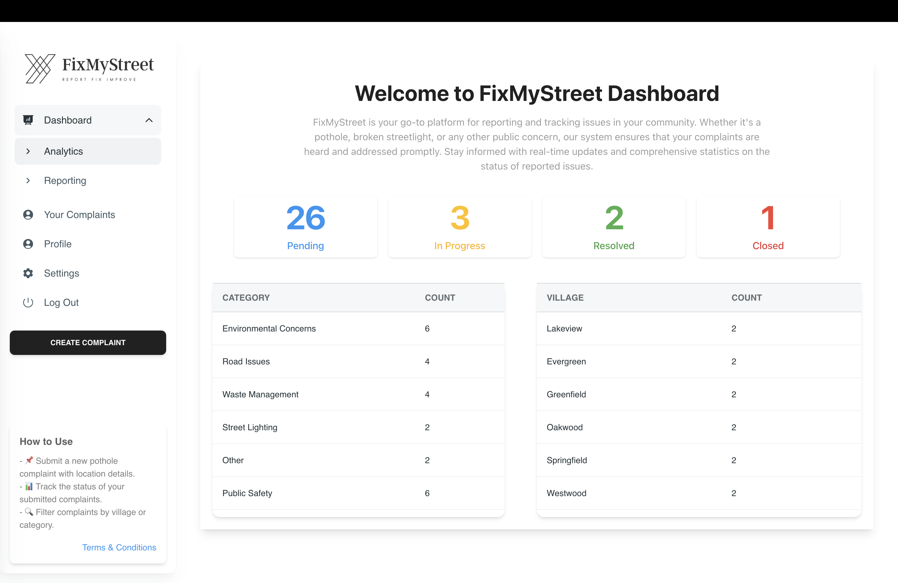
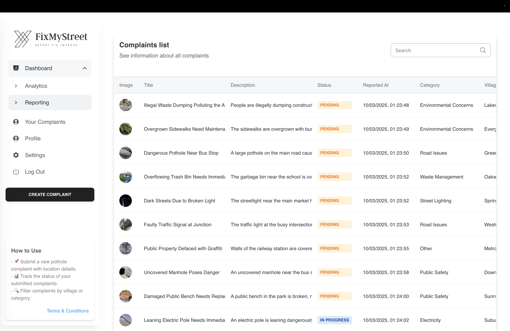
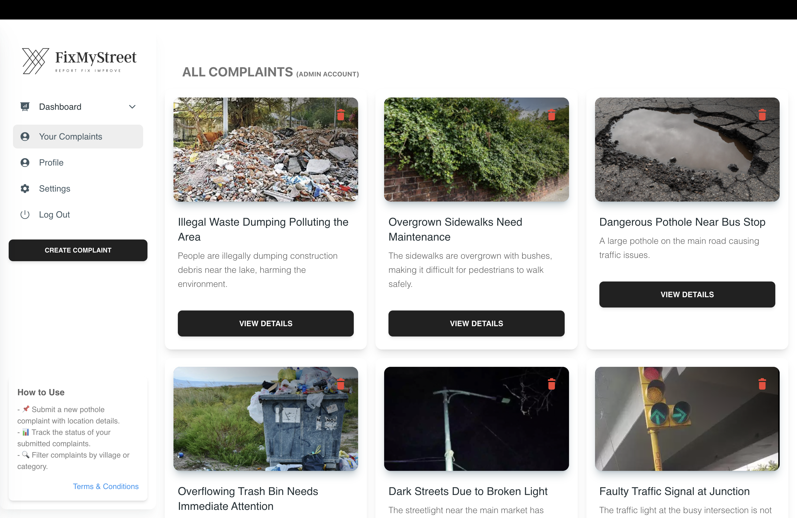
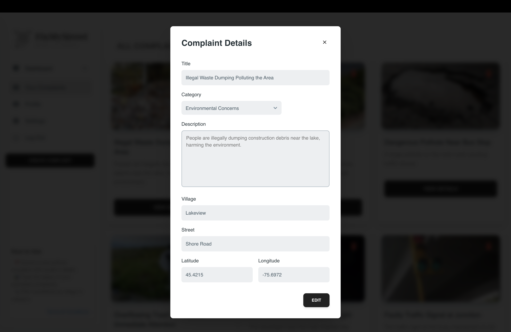
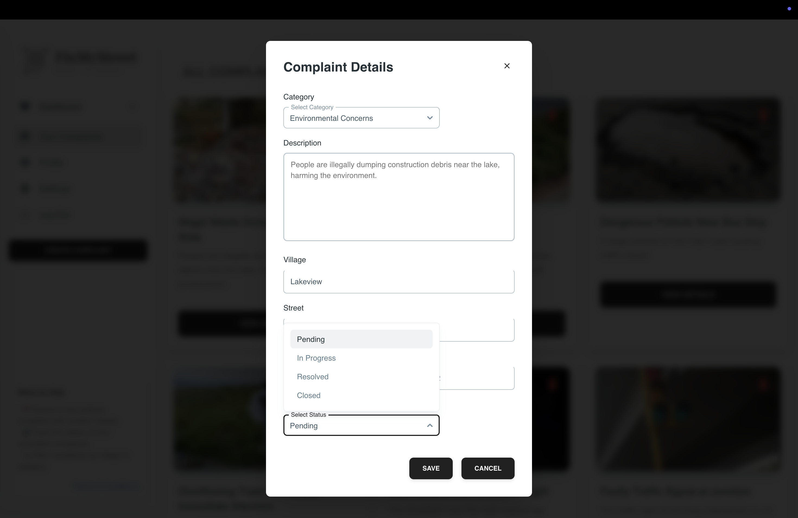
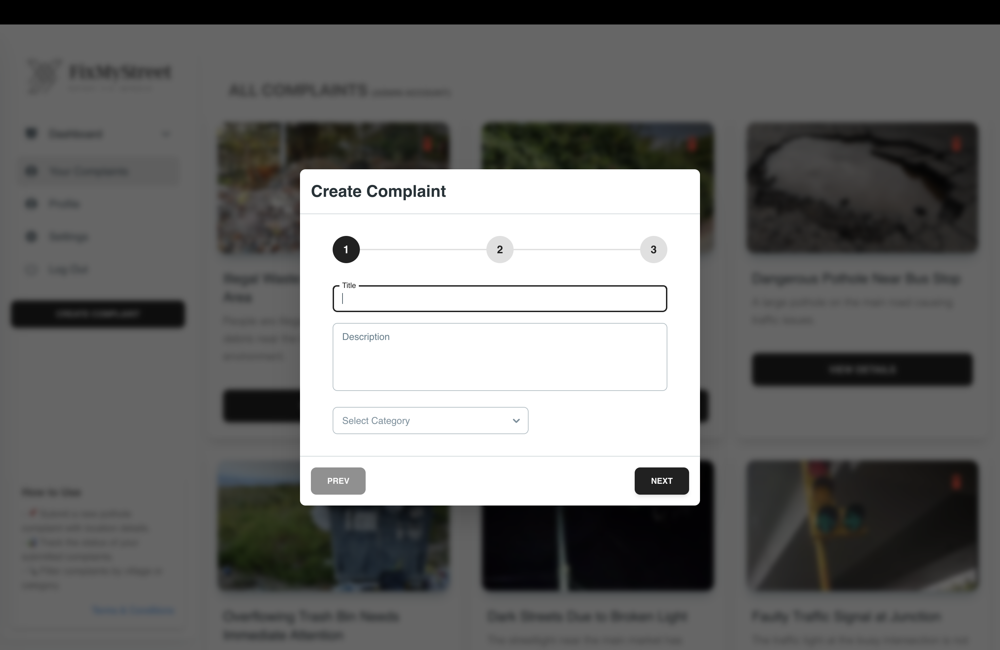
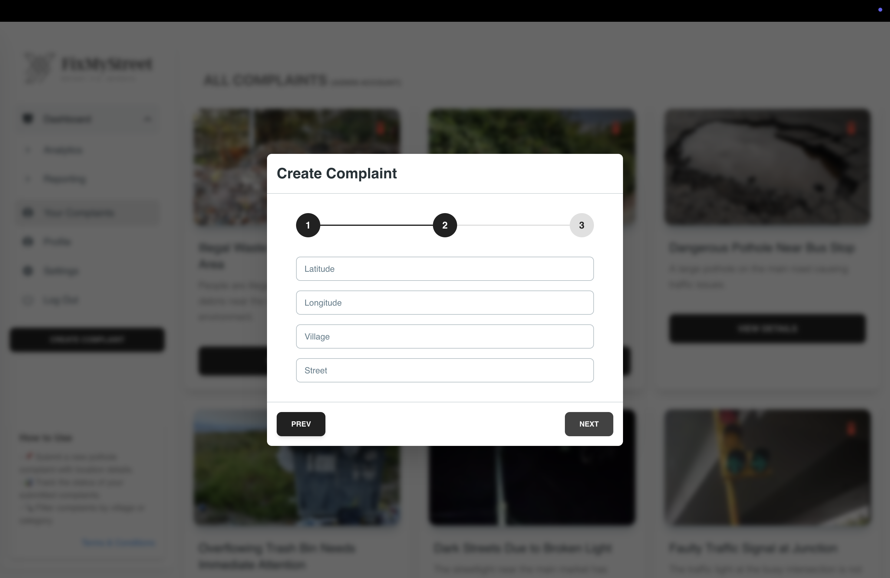
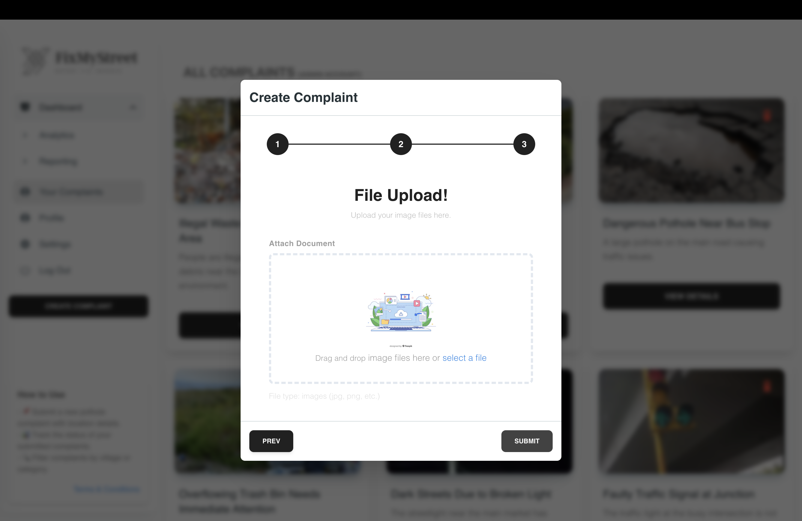
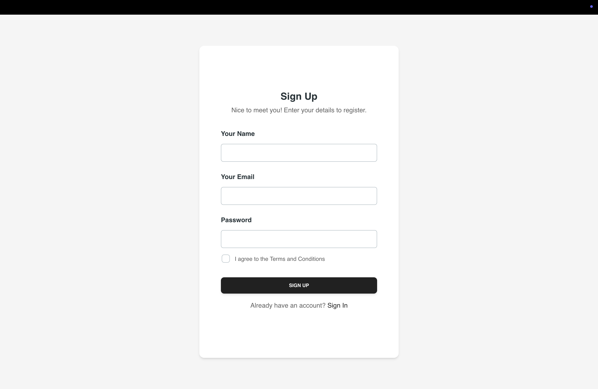
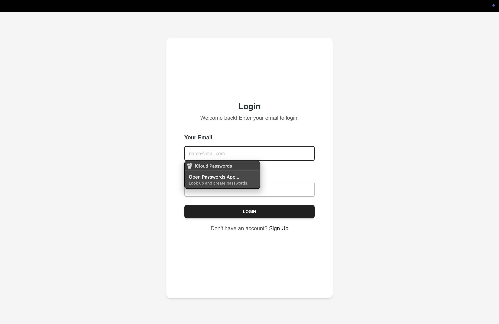

# FixMyStreet UI Demo

## Dashboard & Insights
The dashboard provides an overview of complaints by category, status, and village.
Using Azure Function HTTP Trigger For Fetching Stats

### Analyst Page 
Displays the number of complaints categorized by status, category, and village.

### Reporting Page
Lists all complaints in a table format with a search functionality for easy access.

## Home Page / Your Complaints Page 
Users can view and edit their own complaints, while admins have access to edit all complaints.

### View Full Details 
Clicking on a complaint card opens a modal with full details.

### Edit Complaint
Users can edit all details except the status, which can only be modified by an admin.

## Complaint Creation
The complaint creation process consists of three steps:

### Step 1: Enter Complaint Details
The first step requires the user to enter key details about the complaint, including:
- Title
- Description
- Category selection (choose from available options or enter a custom category)

### Step 2: Enter Location Details
The second step captures important location-related details such as:
- Latitude and longitude
- Village name
- Street address

### Step 3: Upload Supporting Files
The final step involves uploading any relevant files or images to support the complaint.

## User Signup & Login
The user signup and login process is shown below in a two-image row format.

    
    

## Application Demo Video
To get a complete walkthrough of the application, watch the demo video below:

*(Click on the thumbnail to watch the demo video.)*